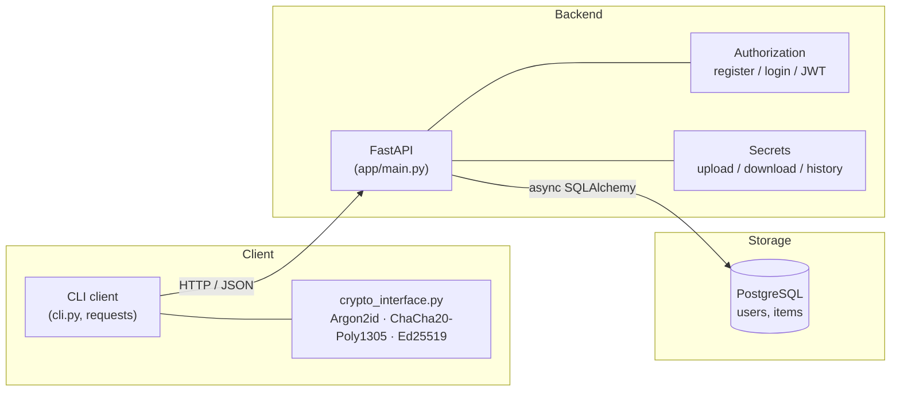
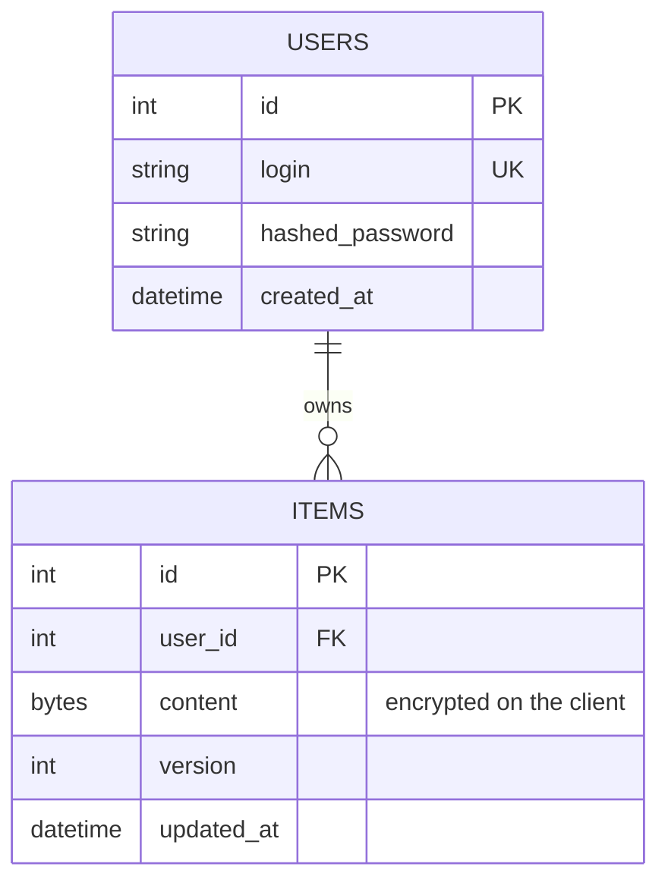
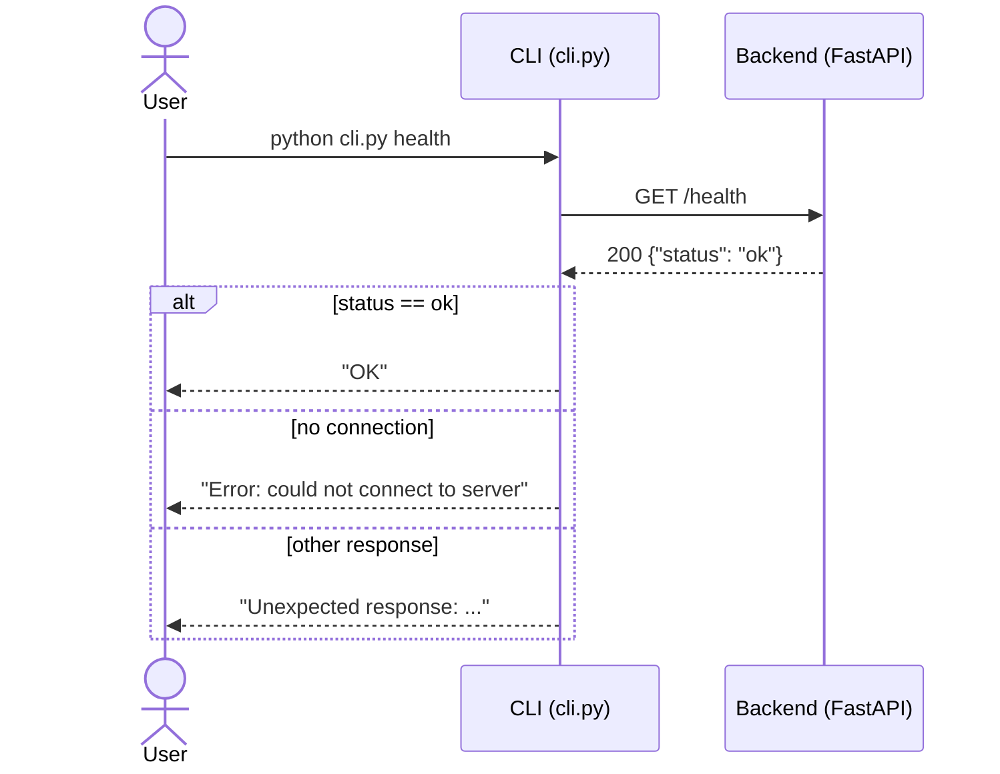
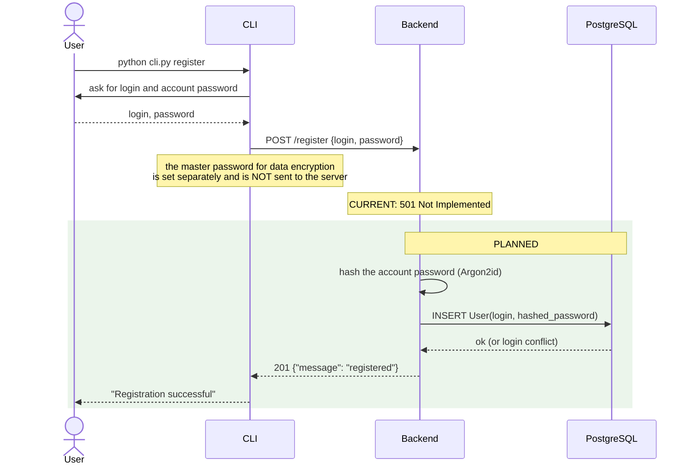
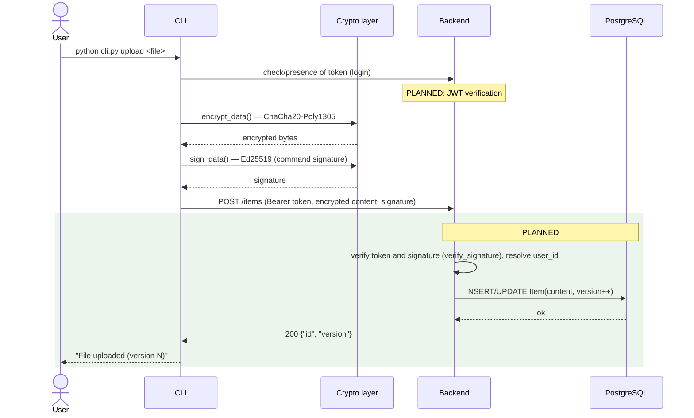

# GophKeeper Architecture

This document describes the overall system architecture, component roles, and how
they interact. Diagrams use the Mermaid format (rendered on GitHub / in VS Code
with the Mermaid plugin).

---

## 1. Overview

GophKeeper follows a classic three-tier client-server design with end-to-end
encryption of sensitive content on the client side.

Principle: secret content is stored in the database as encrypted bytes
(`Item.content: bytes`). Cryptographic operations are split by role: the CLI
encrypts and decrypts user data, while the backend only verifies passwords and
signatures.

---

## 2. Component roles

| Component          | Purpose |
|--------------------|---------|
| **CLI client**     | Entry point for the user. Parses commands, sends HTTP requests to the server, stores the token, calls the crypto module. |
| **Backend (API)**  | FastAPI application. Routing, validation (Pydantic), business logic for registration/login and working with secrets. |
| **DB layer & models** | Async SQLAlchemy engine, sessions, the `User` and `Item` models. |
| **Cryptography**   | `crypto_interface.py`. Operations are split by role: the CLI encrypts/decrypts data, the backend verifies passwords and signatures. See [section 4](#4-cryptography-ivan). |
| **PostgreSQL**     | Persistent storage: the `users` and `items` tables. |

### Data model

---

## 3. Interaction diagrams

### Diagram: health

Server availability check. The only fully working scenario at this stage.

### Diagram: registration (stub — target scenario)

At this stage the server returns `501 Not Implemented`. The diagram shows the
**planned** behavior after implementation.

### Diagram: file upload (stub — target scenario)

Shows the role of client-side encryption: content is encrypted BEFORE being sent
to the server.

---

## 4. Cryptographic Primitives

The chosen algorithms are tailored for a password manager where data is encrypted on the client side and the server stores only encrypted blobs.

### Password Hashing — Argon2id
- **Rationale**: Argon2id is the winner of the Password Hashing Competition (2015) and is recommended by OWASP. It is resistant to GPU and ASIC attacks due to its high memory requirements. Configuration: time_cost=3, memory_cost=65536 (64 MB), parallelism=1.
- **Libraries**: `argon2-cffi` for password hashing and verification; `cryptography.hazmat.primitives.kdf.argon2.Argon2id` for deriving encryption keys from the master password.

### Symmetric Encryption — ChaCha20-Poly1305 (AEAD)
- **Rationale**: ChaCha20 is a modern stream cipher, and Poly1305 is a message authentication code. Together they provide authenticated encryption with associated data (AEAD), ensuring both confidentiality and integrity. The software implementation is constant-time and safe even without hardware acceleration. A random 12-byte nonce is generated for each encryption operation.
- **Implementation**: `cryptography.hazmat.primitives.ciphers.aead.ChaCha20Poly1305`.
- **Key Management**: The 256-bit key is derived from the user's master password using Argon2id (KDF) and never leaves the client.

### Digital Signatures — Ed25519
- **Rationale**: Ed25519 is a fast, secure elliptic-curve signature scheme. The private key stays on the client, while the public key is stored on the server. This guarantees that even a fully compromised server cannot forge user commands.
- **Implementation**: `cryptography.hazmat.primitives.asymmetric.ed25519`.

All cryptographic operations are encapsulated in the `crypto_interface.py` module, providing a unified interface for both CLI and backend.

---
