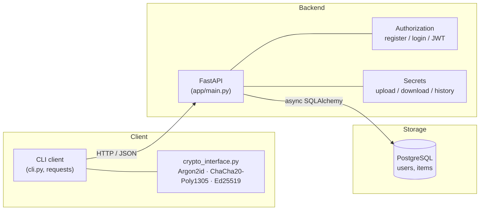
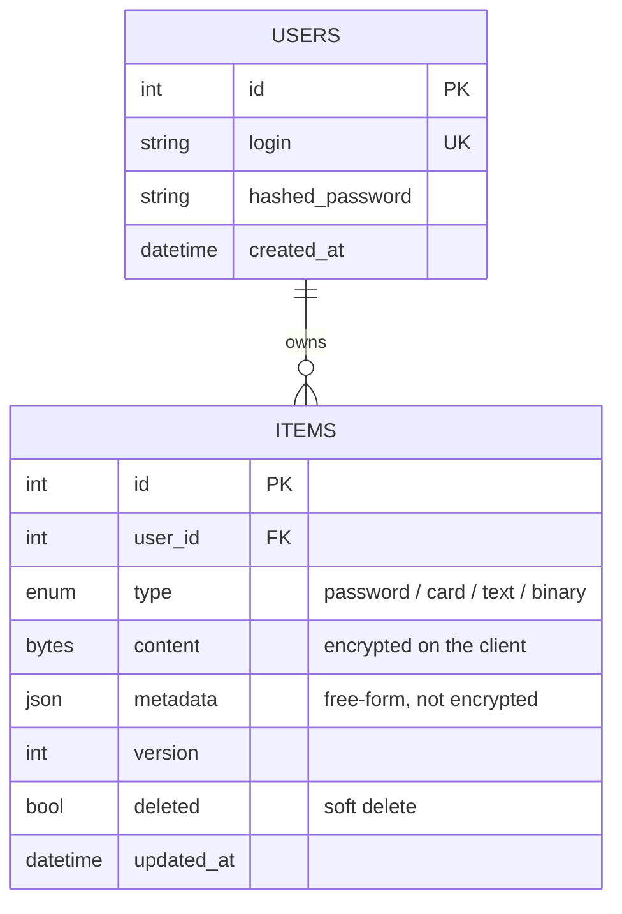
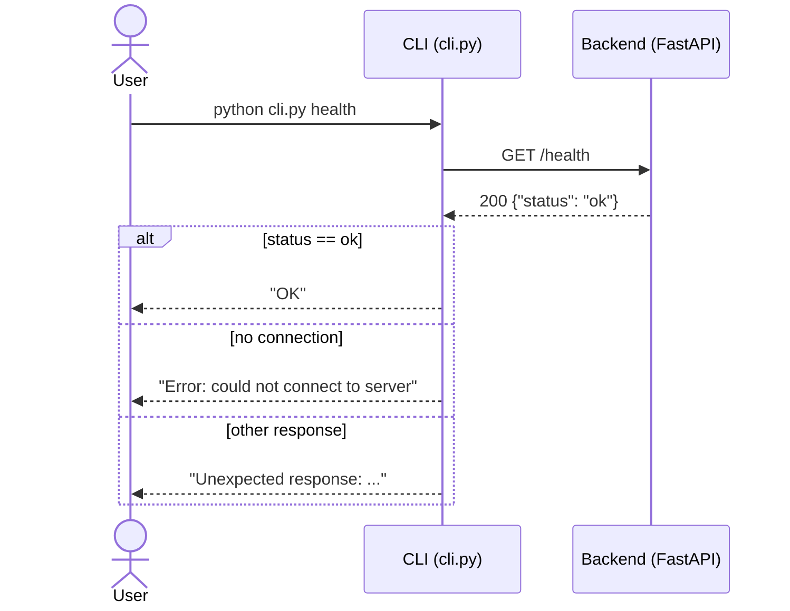
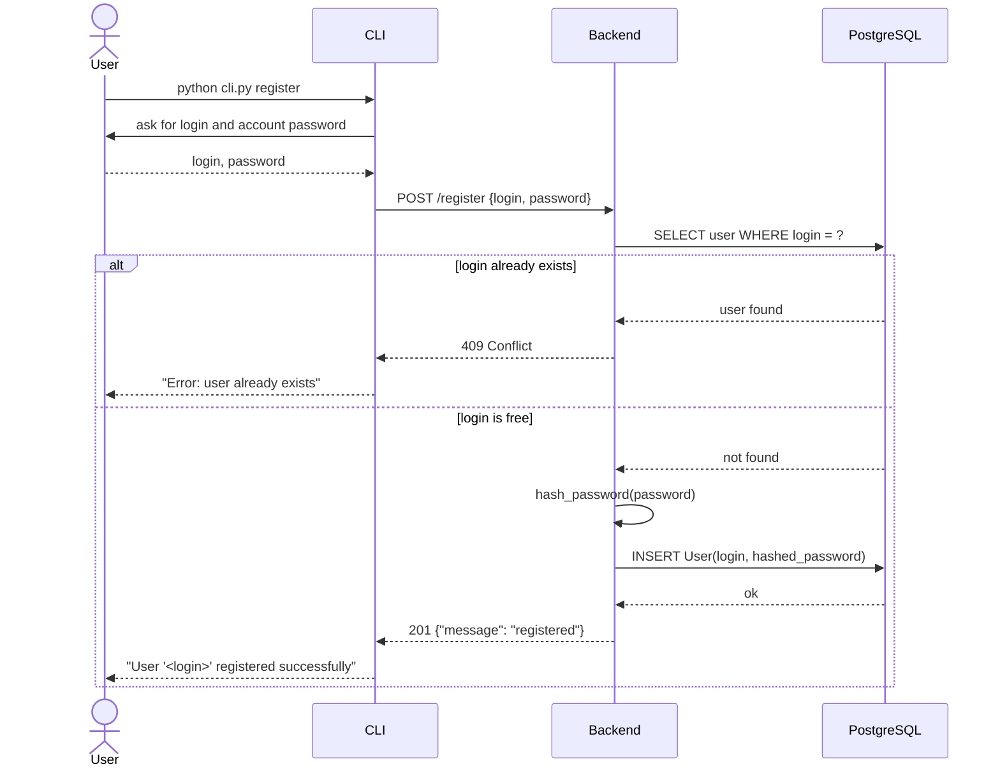
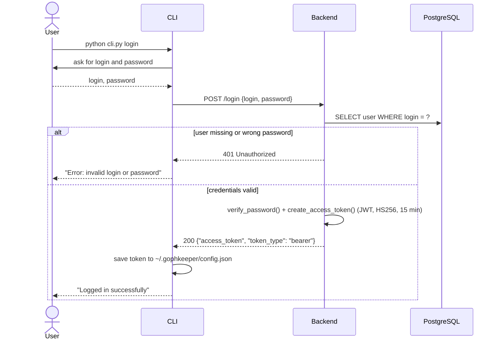
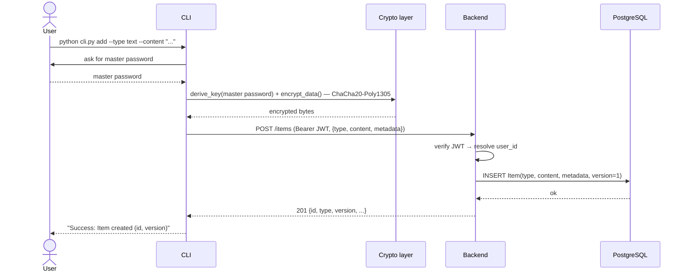
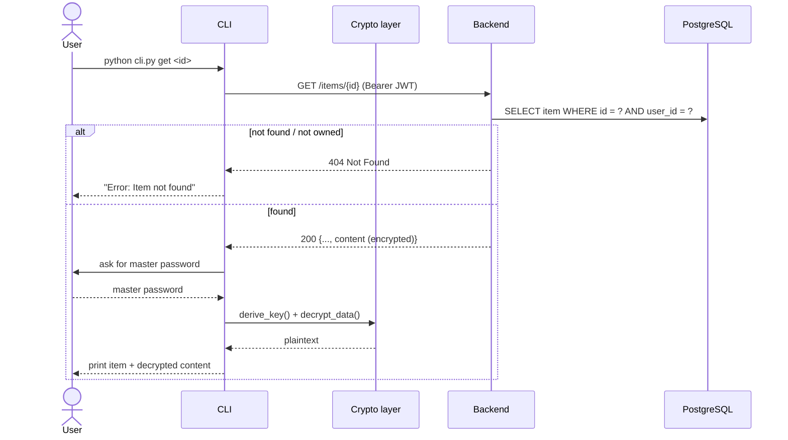
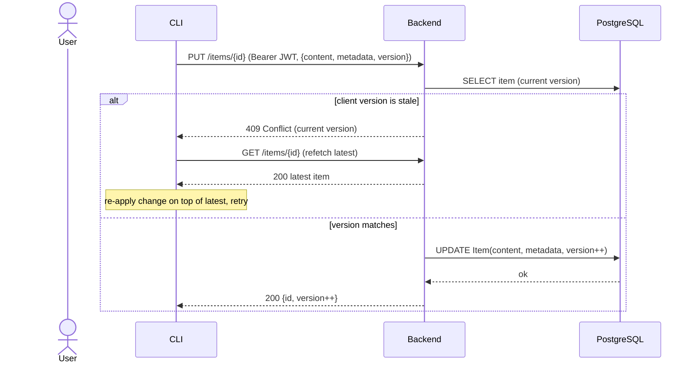

# GophKeeper Architecture

This document describes the overall system architecture, component roles, and how
they interact. Diagrams use the Mermaid format (rendered on GitHub / in VS Code
with the Mermaid plugin).

---

## 1. Overview

GophKeeper follows a classic three-tier client-server design with end-to-end
encryption of sensitive content on the client side.

Principle: secret content is stored in the database as encrypted bytes
(`Item.content: bytes`). Cryptographic operations are split by role: the CLI
encrypts and decrypts user data, while the backend only verifies passwords and
signatures.

---

## 2. Component roles

| Component          | Purpose |
|--------------------|---------|
| **CLI client**     | Entry point for the user. Parses commands, sends HTTP requests to the server, stores the token, calls the crypto module. |
| **Backend (API)**  | FastAPI application. Routing, validation (Pydantic), business logic for registration/login and working with secrets. |
| **DB layer & models** | Async SQLAlchemy engine, sessions, the `User` and `Item` models. |
| **Cryptography**   | `crypto_interface.py`. Operations are split by role: the CLI encrypts/decrypts data, the backend verifies passwords and signatures. See [section 4](#4-cryptography-ivan). |
| **PostgreSQL**     | Persistent storage: the `users` and `items` tables. |

### Data model

---

## 3. Interaction diagrams

### Diagram: health

Server availability check. The only fully working scenario at this stage.

### Diagram: registration

Implemented flow (`POST /register`). The account password is hashed on the
server; the encryption master password is separate and is never sent.

### Diagram: login

Implemented flow (`POST /login`). On success the server issues a JWT and the
client stores it locally.

### Diagram: add item

Implemented flow (`POST /items`). Content is encrypted on the client BEFORE it is
sent; the server stores only ciphertext.

### Diagram: get item

Implemented flow (`GET /items/{id}`). The server returns ciphertext; the client
decrypts it locally.

### Diagram: update & synchronization (version conflict)

Each item carries a `version`. On update the client sends the version it has; if
it is stale, the server rejects with `409 Conflict` so the client can refetch and
retry. `POST /items/sync` returns the full current set for reconciliation.

---

## 4. Cryptographic Primitives

The chosen algorithms are tailored for a password manager where data is encrypted on the client side and the server stores only encrypted blobs.

### Password Hashing — Argon2id
- **Rationale**: Argon2id is the winner of the Password Hashing Competition (2015) and is recommended by OWASP. It is resistant to GPU and ASIC attacks due to its high memory requirements. Configuration: time_cost=3, memory_cost=65536 (64 MB), parallelism=1.
- **Libraries**: `argon2-cffi` for password hashing and verification; `cryptography.hazmat.primitives.kdf.argon2.Argon2id` for deriving encryption keys from the master password.

### Symmetric Encryption — ChaCha20-Poly1305 (AEAD)
- **Rationale**: ChaCha20 is a modern stream cipher, and Poly1305 is a message authentication code. Together they provide authenticated encryption with associated data (AEAD), ensuring both confidentiality and integrity. The software implementation is constant-time and safe even without hardware acceleration. A random 12-byte nonce is generated for each encryption operation.
- **Implementation**: `cryptography.hazmat.primitives.ciphers.aead.ChaCha20Poly1305`.
- **Key Management**: The 256-bit key is derived from the user's master password using Argon2id (KDF) and never leaves the client.

### Digital Signatures — Ed25519
- **Rationale**: Ed25519 is a fast, secure elliptic-curve signature scheme. The private key stays on the client, while the public key is stored on the server. This guarantees that even a fully compromised server cannot forge user commands.
- **Implementation**: `cryptography.hazmat.primitives.asymmetric.ed25519`.

All cryptographic operations are encapsulated in the `crypto_interface.py` module, providing a unified interface for both CLI and backend.

---

## 5. Items API and synchronization

The secrets API (`app/api/routes/items.py`) exposes CRUD over a user's encrypted
items. Every endpoint is protected by JWT (`get_current_user` dependency) and
scoped to the authenticated user.

| Method & path        | Purpose                                                      |
|----------------------|-------------------------------------------------------------|
| `POST /items/`       | Create an item (`type`, encrypted `content`, `metadata`) → `201` |
| `GET /items/`        | List the user's items without content (`id`, `type`, `version`, `updated_at`, `metadata`) |
| `GET /items/{id}`    | Get a single item including encrypted `content` (`404` if not found/owned) |
| `PUT /items/{id}`    | Update with a version check (`409` on conflict, `404` if missing) |
| `DELETE /items/{id}` | Soft-delete (`deleted = true`, row kept) → `204`            |
| `POST /items/sync`   | Batch sync: returns all non-deleted items for reconciliation |

**Synchronization model.**

- The server is the source of truth; each item has an integer `version`.
- `version` auto-increments on every successful update and `updated_at` is
  refreshed.
- The client sends the version it currently holds on `PUT`. If it is stale, the
  server returns `409 Conflict` with the current version; the client refetches
  the latest item and retries (Last-Write-Wins is planned for full auto-sync).
- `DELETE` is a **soft delete**: the row stays in the database with
  `deleted = true` and is excluded from `list` / `sync` results.
- `POST /items/sync` returns the full current set (`id`, `version`,
  `updated_at`, `content`, `metadata`) so a client can reconcile local state.
- The CLI keeps a **local cache** (`~/.gophkeeper/cache.json`): `list` reads from
  it by default and refreshes from the server with `--refresh` (falling back to
  the cache when offline); `add` / `get` / `delete` keep it in sync.

**Encryption boundary.** The CLI encrypts `content` with ChaCha20-Poly1305
(key derived from the master password) before sending, and decrypts on `get`.
The backend never sees plaintext — it stores and returns ciphertext only.

---
